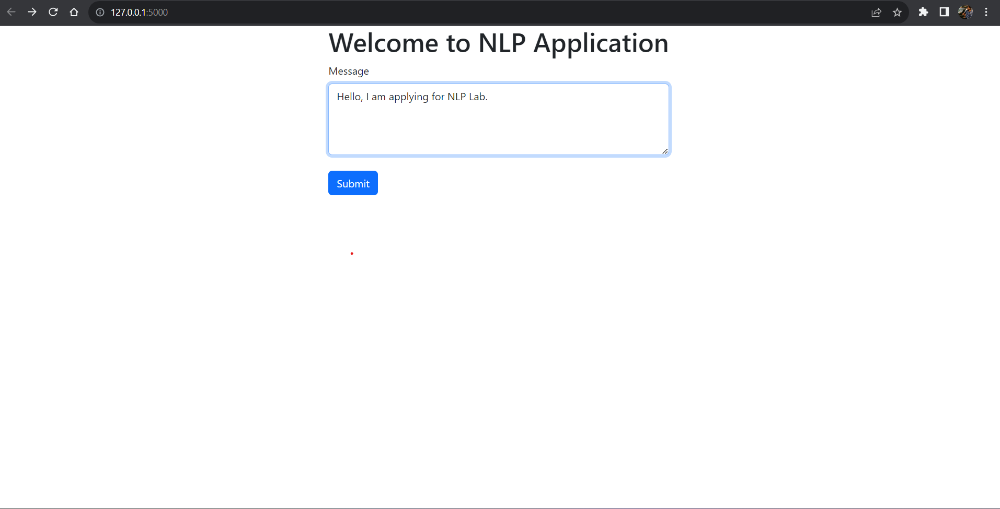
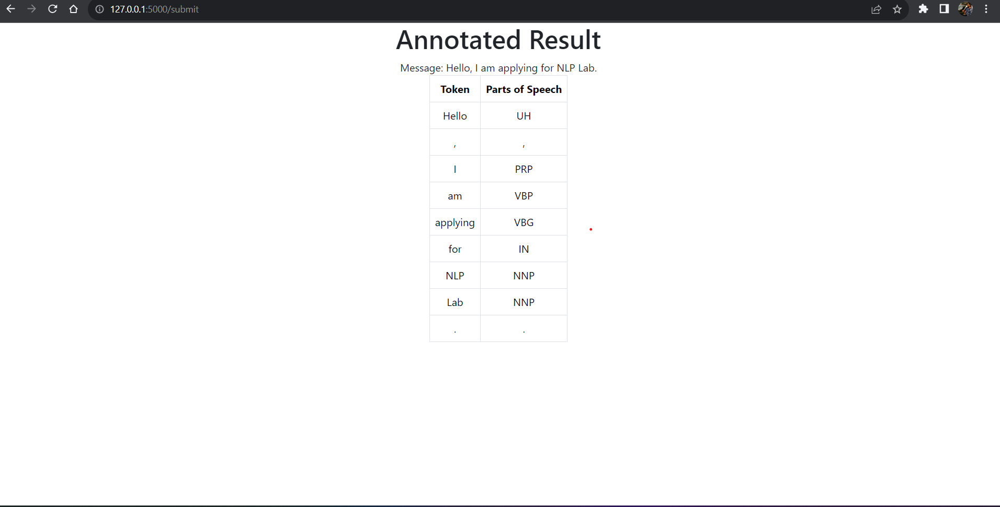
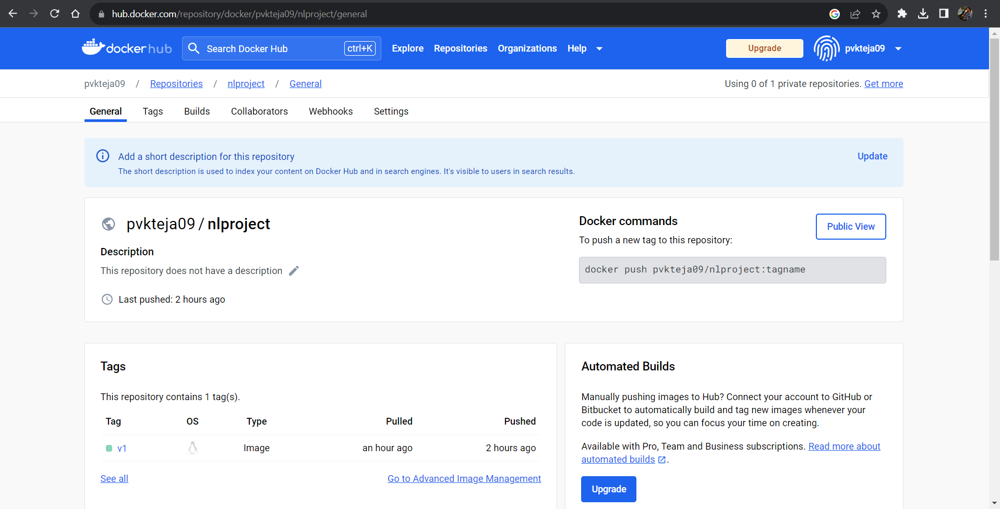

## NLP Frontend/full stack Task
This is a web application that takes text input and provide annotations.

Note: Due to technical issues with docker, I couldn't host it in AWS. 

Technologies utilized:
1. Python
2. Flask
3. HTML
4. CSS, Bootstrap
5. Javascript

## How to run the application
1. Clone the repository
2. Install the dependencies
    1. pip install Flask
    2. pip install stanfordnlp
3. change working directory to root and run command "python app.py"
4. To start stanfordcoreNLP library run the following command in cmd - "java -mx4g -cp "*" edu.stanford.nlp.pipeline.StanfordCoreNLPServer -port 9000 -timeout 15000"

The following are the screenshots of the frontend and annotations that are provided by the library.

I have uploaded the scripts to docker but due to some issue I couldn't push my entire code into it.
